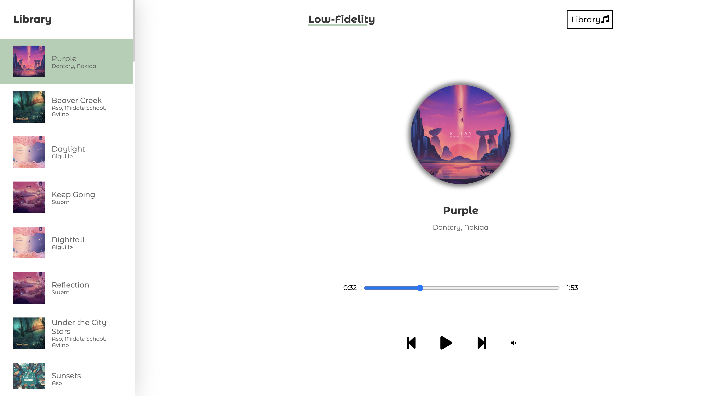

# Low-Fidelity - Low-fi / Chilled Music Player
[Link to live demo](https://jamie-chandler.github.io/react-music-player/)

### What Is The Project?

This is my take on creating an in-browser music player. It has a 'library' of over 60 different (non-copyrighted) chilled music, perfect for Coding or working along to. It is fully *mobile responsive*!

### Built With

- [React.js](https://reactjs.org/)
- [SASS](https://sass-lang.com/)

This was my first 'big' React project, and it was a big learning curve. Some react fundamentals that were implemented and learned along the way:
- useState
- useEffect
- Props
- Events
- Async & Await
- UUID (from uuidv4)

